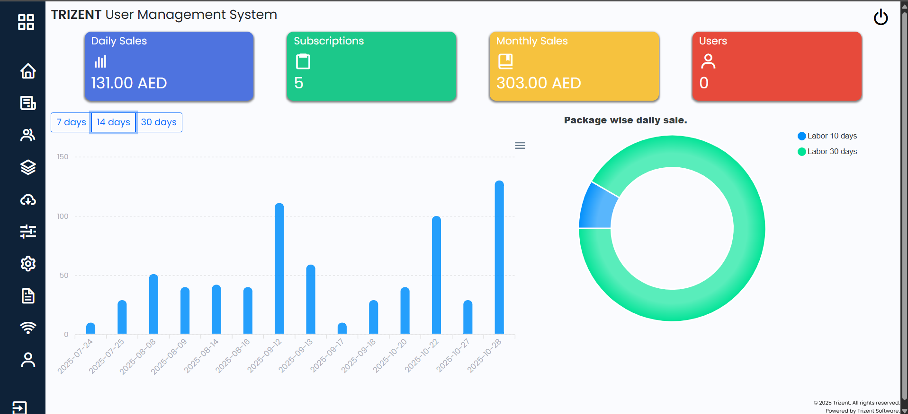
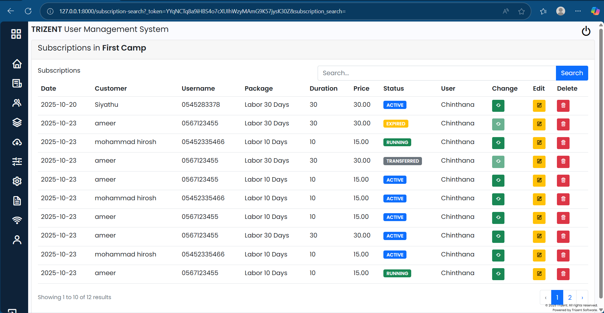
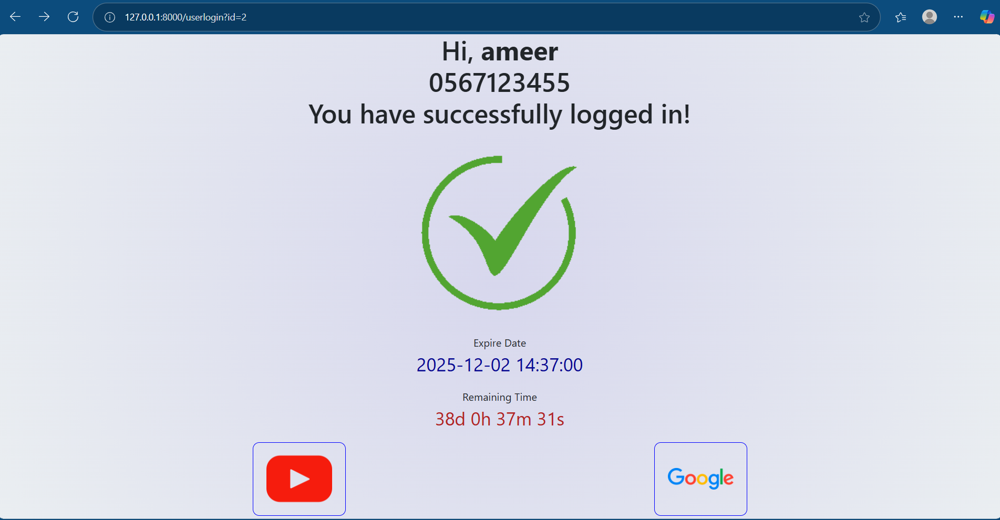

## CloudTik – ISP Management System (Web Application)
CloudTik is a full-featured Internet Service Provider (ISP) Management System designed for labor camps and shared internet environments.
The system supports customer registration, subscription management, invoicing, MikroTik integration, and multi-camp operations.

## Features
### Customer Management
- Create, edit, and manage customers
- Track device MAC addresses
- Customer activity logs
- Account status & expiry tracking

### Subscription
- Create customizable packages (any number of days + price)
- Categorize packages by customer type
- Subscription renewal and recharge
- View active, upcoming, and expired subscriptions

### Invoice & Payment System
- Web-based invoice creation
- Supports voucher and subscription invoices
- Customer invoice history
- Integrated with mobile application (CloudTik Sales)

### MikroTik Integration
- RouterOS API integration
- Automatic hotspot user creation
- MAC binding
- Session login tracking

### Multi-Camp Support
- Manage different labor camps
- Assign customers to camps
- Camp-level reports
- Camp-level package configuration

### User Access Control
- Role-based permissions & gate policies
- Admin, Manager, Salesperson roles
- Access controlled by designation

### Dashboard
- Daily/weekly/monthly sales
- Active customers
- Upcoming expiries
- Package-based statistics

## Tech Stack

- **Backend:** Laravel 10
- **Frontend:** Blade, jQuery, Bootstrap
- **Database:** MySQL
- **API Integration:** MikroTik RouterOS API
- **Auth:** Laravel Breeze / Sanctum
- **Other Tools:** Postman

## Connected Mobile Application
The CloudTik Sales mobile app (Flutter) integrates with this backend to allow sales teams to:
- Register customers
- Create subscriptions
- Reset MAC address
- View sales performance
(Separate README will cover the mobile app.)

## Screenshots

## Installation Guide

Follow the steps below to install and run the CloudTik web application on your local environment.

### Clone the Repository

    git clone https://github.com/your-username/CloudTik.git

    cd CloudTik

### Install PHP Dependencies

    composer install

### Install Frontend Dependencies

    npm install

    npm run build

(Or use npm run dev during development.)

### Environment Setup
Copy the example environment file:

    cp .env.example .env

Generate application key:

     php artisan key:generate

Now update your .env file with:

-**Database credentials**

-**MikroTik API settings**

-**APP_URL**

Run Migrations

    php artisan migrate

Note: **After migration is completed run the 'initialize.sql' file in database to initialize settings and access**

Start the Development Server

    php artisan serve

The CloudTik web system should now be running locally.

## Deployment Instructions for cloud
- add the files in hotspot folder to the files in Mikrotik (login is executed by API, change the API link in login.html as necessary)
- add Walled Garden rule to Mikrotik depending on the hosting domain.
- add schedule to hosting platform to execute expired users, **subscriptions:check-expired**

## Future Improvements
- Implement voucher issue for none registered customers
- Advanced analytics and reporting
- Auto-expiry notifications via WhatsApp / SMS
- Complete multi-language support
- More detailed hotspot user analytics

## 

## Connect with me  

- LinkedIn: \*www.linkedin.com/in/chinthana-edirisinghe-42399321a\*  

- Email: \*chinthana144@gmail.com\*  

Thanks for visiting my profile!2753a514935a4062d93d73441b5
>>>>>>> chinthana_dev
